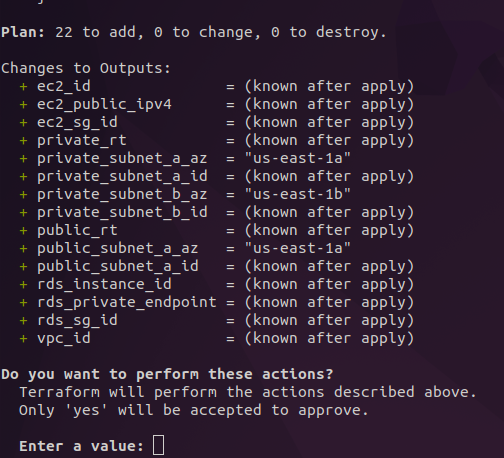
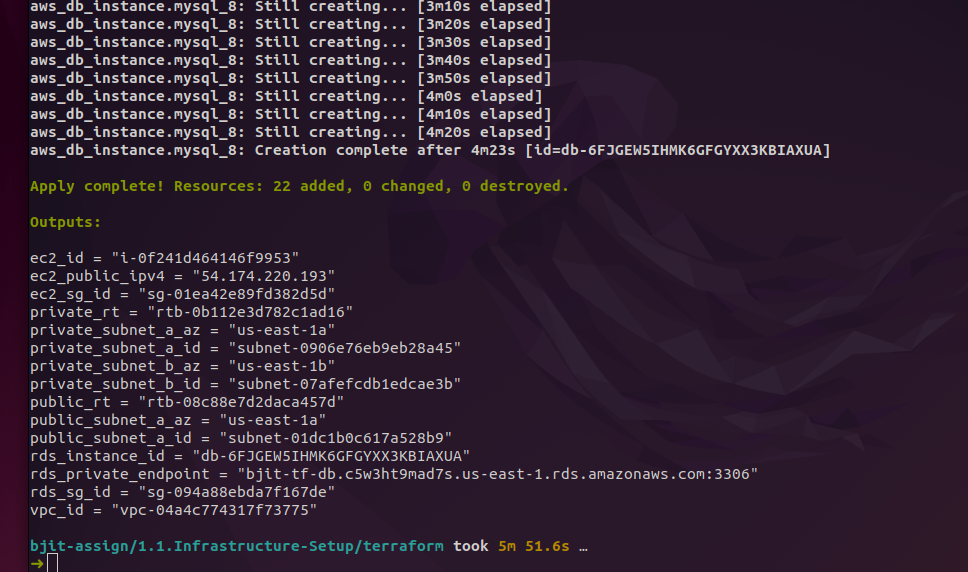
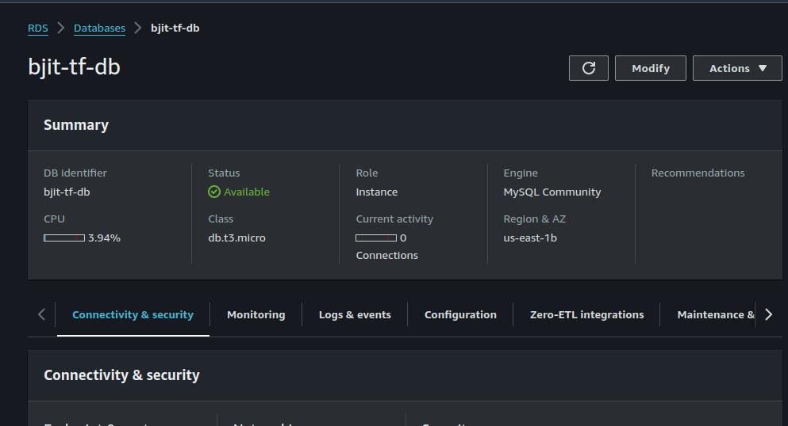
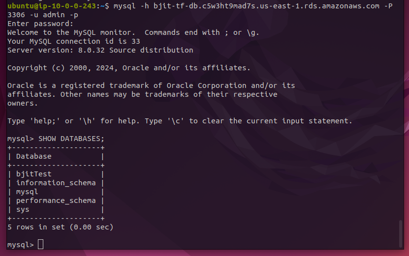

#### 1.1 Infrastructure Setup:
Task: Use Terraform to create a simple AWS infrastructure that includes:
- A VPC with two subnets (one public, one private)
- An EC2 instance in the public subnet
- An RDS instance in the private subnet
- A security group to allow SSH access to the EC2 instance and appropriate access to the RDS instance.

**Deliverable: Provide the Terraform code and explain your approach**

_**This directory contains all the code relevant to this task.**_

### My approach and Explanation: 

The setup includes a Virtual Private Cloud (VPC) with three subnets, one public and two private(by default RDS needs two subnets, that's why I created a total of 3 subnets). I also included an EC2 instance in the public subnet and an RDS instance in the private subnet, all secured with appropriate security groups.

First, I configured the AWS provider and specified the region where the resources would be created. Then, I created a VPC with a CIDR block of 10.0.0.0/16 to serve as the isolated network for our infrastructure.

I divided this VPC into three subnets: a public subnet (10.0.0.0/24) where the EC2 instance will reside and two private subnets (10.0.1.0/24, 10.0.2..0/24) for the RDS instance. The public subnet has been configured to map public IP addresses to instances launched within it, enabling external access.

To allow the public subnet to communicate with the internet, I set up an Internet Gateway and associated it with the VPC. I also created a route table for the public subnet that routes all traffic (0.0.0.0/0) through this Internet Gateway. 

For the EC2 instance, I created a security group that allows SSH access (port 22) from anywhere, ensuring that engineers can connect to the instance for management and troubleshooting. For the RDS instance, I created another security group that allows MySQL access (port 3306) but only from the EC2 instance's security group. This ensures that the database can only be accessed by the EC2 instance and not directly from the internet.
Also, I created an EC2 instance role with Assume Role Policy for performing any database operation. 

The EC2 instance itself is a t2.micro instance running Ubuntu. It's placed in the public subnet and assigned to the EC2 security group. This setup allows SSH access from the internet while restricting all other types of traffic.


For the RDS instance, I used a MySQL database with 20 GB of storage, db.t3.micro instance class. The RDS instance is placed in the private subnet to keep it isolated from direct internet access. To ensure the RDS instance is only in the private subnet, I created an RDS subnet group that includes only the private subnet.

This setup provides a secure, isolated network with a publicly accessible EC2 instance and a private RDS instance. This configuration balances accessibility and security, making it ideal for web applications requiring a database backend. 

#### For running this infra. Please follow these steps: 

Please make sure you have Terraform, AWS CLI installed and configured. 

**Clone the terraform code repo**

```bash
git clone https://github.com/akiltipu/bjit-assignment.git
```

Go to `terraform` directory inside `1.1.Infrastructure-Setup` and open and edit `variables.tf` file. Change the values as your need.

**Next, run the following command to initiate the backend.**

```bash
terraform init
```

**Next, run the following command to generate a plan before provisioning**

```bash
terraform plan
```

**Thoroughly check the plan and run the following command to apply and start the provisioning process.**

```bash
terraform apply -auto-approve
```

 
**Terrafrom apply completed:**





RDS (MySQL on the AWS console)



**SSH in EC2 and Connected to the DB.** 



