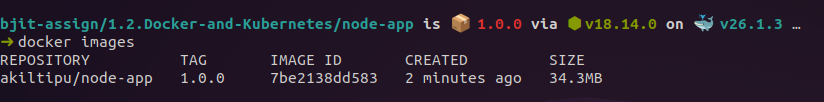
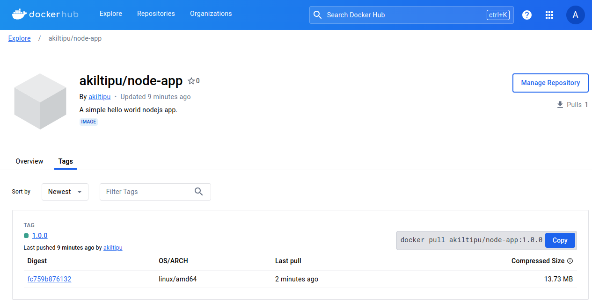
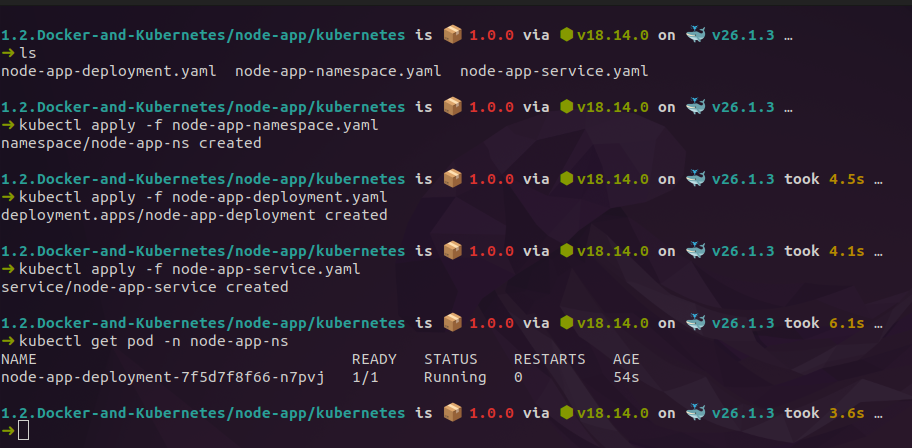
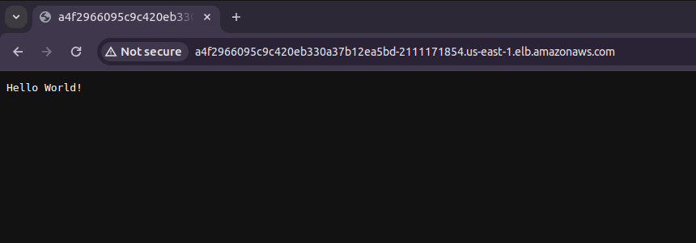

### 1.2 Docker & Kubernetes:
**Task:** Create a Dockerfile for a simple Node.js application and a Kubernetes deployment YAML file to deploy the Docker container.

**Deliverable:** Provide the Dockerfile, the deployment YAML file, and outline the steps to deploy the application to a Kubernetes cluster.

### My approach and explanations:


To deploy a Node.js application, I created a Dockerfile `(node-app/Dockerfile)` using a multi-stage build to reduce the final image size. The Dockerfile has two stages: a build stage and a runtime stage.

In the build stage, I used the `node:12-stretch` image to install the necessary dependencies. I set the working directory to `/build`, copied the `package-lock.json` and `package.json` files, and ran `npm ci` to install the dependencies. Then, I copied the rest of the application files into the build directory.

In the runtime stage, I used a lightweight `alpine:3.10` image. I installed Node.js using `apk add --no-cache nodejs` to keep the image small. I created a `non-root` user called node for security purposes. I set the working directory to `/home/node/code` and copied the built application from the build stage to the runtime stage, ensuring the files are owned by the node user. Finally, I exposed `port 3000` and set the command to run the application using `node index.js`. 
Then I build docker images and pushed to dockerhub. 

Next, I created a Kubernetes deployment YAML files to deploy the Docker container. I isolated resources inside a namespace and used a LoadBalancer to expose the application on a browser.

### Steps to Deploy the Application:

**Build the Docker Image:**

Ensure you are in the directory `cd node-app` containing your Dockerfile and node application files.

```sh
docker build -t akiltipu/nodejs-app:1.0.0 .
```


**Push the Docker Image to DockerHub:**

Tagging image appropriately and push it to DockerHub.

```sh
docker tag akiltipu/nodejs-app:1.0.0 akiltipu/nodejs-app:1.0.0
docker push akiltipu/nodejs-app:latest
```




**Create the Kubernetes Namespace, Deployment, and Service:**

Go to kubernetes directory `cd kubernetes`  to Apply the Kubernetes YAML configuration to the cluster.
First need to create namespace. 
namespace could be created using `kubectl` command like this

```sh
kubectl create namespace node-app-ns
```
or using namespace service file like below. 

```bash
kubectl apply -f 1-node-app-namespace.yaml
```

Deployment and Service: 

```bash
kubectl apply -f 2-node-app-deployment.yaml
kubectl apply -f 3-node-app-service.yaml
```



Verify the Deployment:
Check the status of pods to ensure they are running correctly.

```sh
kubectl get pods -n node-app-ns

```

Application running successfully: 

